# AFD - Analizador Léxico C#

## Diagrama del Autómata Finito Determinístico

Este diagrama representa el autómata que reconoce los tokens del lenguaje C# en el analizador léxico.

```mermaid
stateDiagram-v2
    [*] --> q0 : Inicio
    
    %% Estado inicial q0
    q0 --> q1 : '{'
    q0 --> q2 : '}'
    q0 --> q3 : '['
    q0 --> q4 : ']'
    q0 --> q5 : '('
    q0 --> q6 : ')'
    q0 --> q7 : ';'
    q0 --> q8 : ','
    q0 --> q9 : '.'
    q0 --> q10 : '='
    q0 --> q12 : '+'
    q0 --> q14 : '-'
    q0 --> q16 : '*'
    q0 --> q17 : '!'
    q0 --> q19 : '<'
    q0 --> q21 : '>'
    q0 --> q23 : '/'
    q0 --> q32 : '"'
    q0 --> q34 : "'"
    q0 --> q28 : [a-zA-Z]
    q0 --> q29 : [0-9]
    q0 --> q0 : [espacio, \n, \t]
    q0 --> [*] : # (fin)
    
    %% Estados de aceptación para símbolos simples
    q1 --> [*] : KEY_O
    q2 --> [*] : KEY_C
    q3 --> [*] : BRA_O
    q4 --> [*] : BRA_C
    q5 --> [*] : PAR_O
    q6 --> [*] : PAR_C
    q7 --> [*] : SEMICOLON
    q8 --> [*] : COMMA
    q9 --> [*] : PERIOD
    q16 --> [*] : MULT
    
    %% Estados para operadores de dos caracteres
    q10 --> q11 : '='
    q10 --> [*] : ASSIGN
    q11 --> [*] : EQUAL
    
    q12 --> q13 : '+'
    q12 --> [*] : PLUS
    q13 --> [*] : INC
    
    q14 --> q15 : '-'
    q14 --> [*] : MINUS
    q15 --> [*] : DEC
    
    q17 --> q18 : '='
    q17 --> [*] : ERROR
    q18 --> [*] : DIFF
    
    q19 --> q20 : '='
    q19 --> [*] : LESS
    q20 --> [*] : LESS_EQ
    
    q21 --> q22 : '='
    q21 --> [*] : GREATER
    q22 --> [*] : GREATER_EQ
    
    %% Estados para comentarios
    q23 --> q24 : '/'
    q23 --> q25 : '*'
    q23 --> [*] : DIV
    
    q24 --> q24 : [cualquier char excepto \n]
    q24 --> [*] : COMMENT
    
    q25 --> q25 : [cualquier char excepto *]
    q25 --> q26 : '*'
    q26 --> q27 : '/'
    q26 --> q25 : [cualquier char excepto /]
    q27 --> [*] : MULTICOMMENT
    
    %% Estados para identificadores y palabras reservadas
    q28 --> q28 : [a-zA-Z0-9_]
    q28 --> [*] : IDENTIFIER/RESERVED_WORD
    
    %% Estados para números
    q29 --> q29 : [0-9]
    q29 --> q30 : '.'
    q29 --> [*] : INTEGER
    
    q30 --> q31 : [0-9]
    q30 --> [*] : ERROR
    q31 --> q31 : [0-9]
    q31 --> [*] : DECIMAL
    
    %% Estados para cadenas
    q32 --> q32 : [cualquier char excepto " y \n]
    q32 --> q33 : '"'
    q32 --> [*] : ERROR
    
    q33 --> [*] : STRING
    
    %% Estados para caracteres
    q34 --> q35 : [cualquier char excepto ']
    q34 --> [*] : ERROR
    
    q35 --> q36 : "'"
    q35 --> [*] : ERROR
    
    q36 --> [*] : CHAR
```

## Descripción de Estados

### Estados de Aceptación Simples (q1-q9, q16)
- **q1**: Llave de apertura `{`
- **q2**: Llave de cierre `}`
- **q3**: Corchete de apertura `[`
- **q4**: Corchete de cierre `]`
- **q5**: Paréntesis de apertura `(`
- **q6**: Paréntesis de cierre `)`
- **q7**: Punto y coma `;`
- **q8**: Coma `,`
- **q9**: Punto `.`
- **q16**: Multiplicación `*`

### Estados para Operadores de Dos Caracteres
- **q10-q11**: Asignación `=` e igualdad `==`
- **q12-q13**: Suma `+` e incremento `++`
- **q14-q15**: Resta `-` y decremento `--`
- **q17-q18**: Negación `!` y diferencia `!=`
- **q19-q20**: Menor `<` y menor o igual `<=`
- **q21-q22**: Mayor `>` y mayor o igual `>=`

### Estados para Comentarios
- **q23-q24**: División `/` y comentario de una línea `//`
- **q25-q27**: Comentario de múltiples líneas `/* */`

### Estados para Identificadores
- **q28**: Identificadores y palabras reservadas (letras, números, guión bajo)

### Estados para Números
- **q29**: Números enteros
- **q30-q31**: Números decimales (con punto)

### Estados para Cadenas
- **q32-q33**: Cadenas de texto entre comillas dobles `"texto"`

### Estados para Caracteres
- **q34-q36**: Caracteres entre comillas simples `'a'`

## Características del AFD

1. **Determinístico**: Cada entrada tiene exactamente una transición
2. **37 estados**: Del q0 al q36
3. **Estados de aceptación**: Todos excepto q0, q10, q12, q14, q17, q19, q21, q23, q24, q25, q26, q28, q29, q30, q32, q34, q35
4. **Manejo de errores**: Estados que detectan caracteres no válidos
5. **Reconocimiento de palabras reservadas**: Se hace en el estado q28

## Ejemplos de Reconocimiento

- `int` → q0 → q28 → q28 → q28 → [IDENTIFIER]
- `123` → q0 → q29 → q29 → q29 → [INTEGER]
- `==` → q0 → q10 → q11 → [EQUAL]
- `"hola"` → q0 → q32 → q32 → q32 → q32 → q33 → [STRING] 